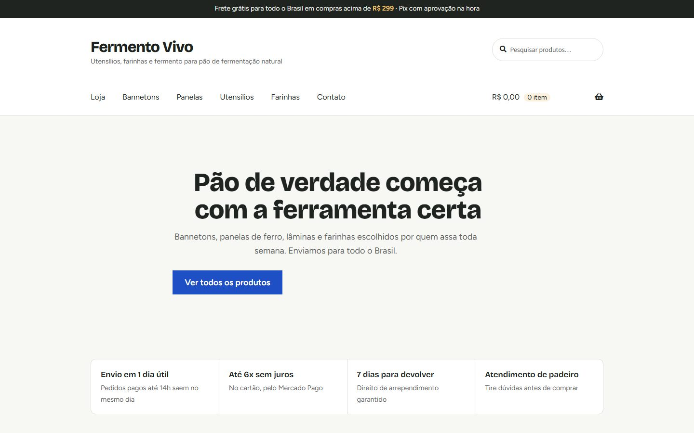

# Loja Fermento Vivo · WordPress + WooCommerce

**[Ver o estudo de caso](https://vitoriamir.github.io/loja-woocommerce/)** · **[Abrir a demo ao vivo](https://playground.wordpress.net/?blueprint-url=https%3A%2F%2Fraw.githubusercontent.com%2FVitoriaMir%2Floja-woocommerce%2Fmain%2Fblueprint-demo.json)**

A demo roda a loja inteira no seu navegador pelo WordPress Playground, sem servidor. Ela leva cerca de 1 minuto para abrir, e você entra como administrador. Loja, produtos e empresa são fictícios.



Loja virtual em WordPress + WooCommerce para hospedagem própria (VPS). Tudo que foi personalizado está neste repositório, em PHP, CSS e JavaScript, sem plugins pagos e sem construtor visual.

O produto de exemplo é uma loja de utensílios para pão de fermentação natural. Os 13 produtos, as fotos (ilustrações geradas pelo script) e os dados da empresa são exemplos. Troque pelos seus antes de publicar.

## O que tem na loja

| Área | Como foi feito |
|---|---|
| Loja e catálogo | WooCommerce, 4 categorias, 13 produtos (1 com variação de tamanho, 1 esgotado para teste), peso e medidas para o frete |
| Layout | Tema filho do Storefront (`wp-content/themes/fermento-vivo`), responsivo, com 2 colunas de produtos no celular |
| Checkout brasileiro | Pessoa física/jurídica, CPF e CNPJ validados (inclusive o CNPJ alfanumérico de 2026), número, bairro, celular, máscaras e endereço automático pelo CEP (ViaCEP) |
| Pagamento | Mercado Pago (Pix, cartão parcelado e boleto). "Pix manual" ligado só no ambiente local, para testes |
| Frete | Melhor Envio (Correios e transportadoras, cotação pelo CEP) + entrega padrão de reserva, frete grátis acima de R$ 299 e retirada na loja |
| Parcelamento | "ou 6x de R$ X sem juros" abaixo do preço, com limites em Configurações > Dados da loja |
| Páginas | Início, Sobre, Contato (formulário próprio), Entregas e frete, Trocas e devoluções, Perguntas frequentes, Privacidade (LGPD) e Termos |
| Segurança | XML-RPC desligado, sem listagem de usuários, limite de tentativas de login, cabeçalhos de segurança, editor de código do painel desligado, fail2ban, firewall e HTTPS |
| Desempenho | Cache de página no Nginx, OPcache, Redis, cache de arquivos no navegador, gzip e remoção de scripts sem uso |
| SEO | Títulos, meta description, Open Graph (links bonitos no WhatsApp), dados estruturados da loja e dos produtos, sitemap e robots.txt |
| Testes | 11 testes automáticos do fluxo de compra (computador e celular) com Playwright |

## Estrutura

```
blueprint.json                     Ambiente local (WordPress Playground)
blueprint-demo.json                Demo ao vivo (lê os arquivos deste repositório no GitHub)
docs/                              Página do estudo de caso (GitHub Pages)
ferramentas/                       Gera o blueprint da demo e as capturas do portfólio
package.json                       npm run loja · npm run teste
setup/
  configurar-loja.php              Configura tudo: opções, páginas, produtos, frete, pagamento, menus
  conteudo/produtos.php            Catálogo (troque aqui pelos seus produtos)
  conteudo/paginas.php             Textos das páginas
  imagens.php                      Gera as ilustrações de exemplo
wp-content/
  themes/fermento-vivo/            Tema filho (visual)
  mu-plugins/fv-loja.php           Núcleo da loja (sempre ativo)
  mu-plugins/fv-loja/              Módulos: checkout, frete, parcelas, contato, segurança, desempenho, SEO
deploy/
  provisionar-vps.sh               Instala tudo num Ubuntu 24.04
  nginx/, php/, fail2ban/          Configurações do servidor
  backup.sh                        Backup diário do banco e das imagens
tests/
  fluxo-compra.spec.js             Testes da compra
  capturas.mjs                     Capturas de tela (computador e celular)
```

A separação é proposital. O **tema** cuida só da aparência, e o **mu-plugin** cuida das regras de negócio. Se um dia você trocar o tema, o checkout brasileiro, o contato e a segurança continuam funcionando.

## Rodar no seu computador

Precisa só do [Node.js](https://nodejs.org) 20 ou mais novo. Não precisa instalar PHP, MySQL nem Docker.

```bash
npm install
```

```bash
npm run loja
```

Na primeira vez leva de 3 a 5 minutos, porque baixa o WordPress e os plugins. Depois, a loja abre em http://127.0.0.1:9400 e o painel em http://127.0.0.1:9400/wp-admin (usuário `admin`, senha `password`).

Mudanças no tema e no mu-plugin aparecem na hora: é só recarregar a página. O banco de dados local é temporário e recomeça do zero a cada `npm run loja`.

### Rodar os testes

Com a loja local no ar, em outro terminal:

```bash
npx playwright install chromium
```

```bash
npm run teste
```

O relatório fica em `tests/relatorio/index.html`. Os testes fazem 3 compras completas: pessoa física com entrega padrão, pessoa jurídica com CNPJ alfanumérico e frete grátis, e retirada na loja. Também testam o formulário de contato, o SEO e a segurança.

## Publicar no VPS

1. Contrate um VPS com **Ubuntu 24.04** e pelo menos **2 GB de RAM**.
2. No painel do seu domínio, crie os registros DNS do tipo **A** para `@` e `www` com o IP do VPS.
3. Copie o projeto para o servidor e rode o instalador:

```bash
scp -r loja-woocommerce root@IP_DO_VPS:/opt/
```

```bash
ssh root@IP_DO_VPS "cd /opt/loja-woocommerce && DOMINIO=minhaloja.com.br EMAIL_ADMIN=voce@email.com bash deploy/provisionar-vps.sh"
```

O script instala Nginx, PHP 8.3, MariaDB, Redis, HTTPS, firewall e backup diário. Depois instala o WordPress, os plugins e o tema, e roda a configuração da loja. No final, ele mostra o endereço do painel e onde ficou a senha. Pode rodar de novo sem problema.

### Depois de publicar (no painel)

1. **Mercado Pago:** em WooCommerce > Mercado Pago, cole as credenciais de produção da sua conta. Configure o parcelamento sem juros com o mesmo número de parcelas de Configurações > Dados da loja.
2. **Melhor Envio:** em Melhor Envio > Token, conecte a conta. Em Configurações, escolha as transportadoras e o endereço de origem. Depois, em WooCommerce > Configurações > Entrega > Brasil, adicione os métodos do Melhor Envio e desative a "Entrega padrão" de valor fixo, se quiser.
3. **Dados da loja:** em Configurações > Dados da loja, preencha WhatsApp, CNPJ, e-mail e endereço.
4. **E-mail:** instale um plugin de SMTP (por exemplo, WP Mail SMTP) com um e-mail do seu domínio. Sem isso, os e-mails de pedido podem cair no spam.
5. **Produtos:** apague os de exemplo e cadastre os seus, ou importe em Produtos > Importar (CSV).
6. **Textos legais:** revise Privacidade, Termos e Trocas com seu contador ou advogado.
7. **Teste real:** faça uma compra de valor baixo com Pix e estorne pelo Mercado Pago.

## Cuidados que já estão no código

- **Melhor Envio sem conta conectada.** A versão 2.16 do plugin quebra o checkout quando não tem token: o pedido é criado, mas o cliente vê um erro. O módulo `frete.php` desliga esse passo até a conta ser conectada e mostra um aviso no painel.
- **Pedidos e Melhor Envio.** O plugin ainda lê alguns dados no formato antigo de pedidos. Por isso, a sincronização de pedidos (HPOS) fica ligada.
- **Campos do checkout.** Os nomes seguem o padrão que o Melhor Envio e o Mercado Pago esperam (`_billing_cpf`, `_billing_cnpj`, `_shipping_number`, `_shipping_neighborhood`...). Assim, as etiquetas de envio já saem com CPF, número e bairro.
- **Checkout clássico.** O carrinho e o checkout usam os shortcodes clássicos do WooCommerce, que o Mercado Pago, o Melhor Envio e os campos brasileiros suportam por completo.

## Atualizações

- Plugins e WordPress: pelo painel, ou `sudo -u www-data wp plugin update --all --path=/var/www/SEU_DOMINIO/public` no servidor. Faça backup antes (`bash deploy/backup.sh SEU_DOMINIO`).
- Tema e mu-plugin: altere aqui, rode `npm run teste` e publique de novo com o mesmo comando do VPS.
